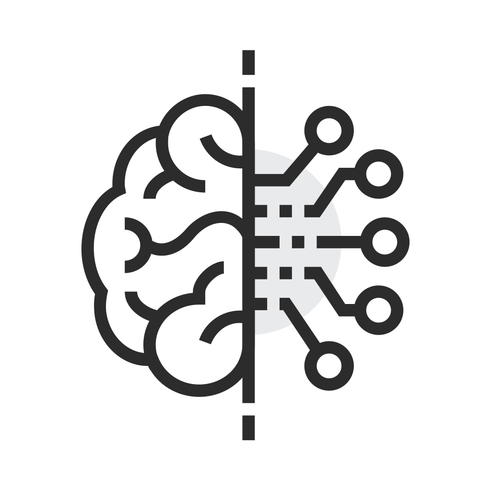
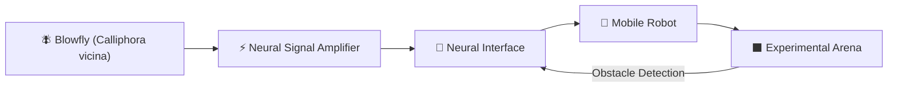

# <h1 align="center">
  🚀 Fly Robot Interface (Neural) — NeuRob
</h1>
<p align="center">
  <em>Bioinspired Neural Control for Real-Time Robotic Collision Avoidance</em><br>
  <strong>Department of Bioengineering</strong> · Imperial College London  
</p>

<p align="center">
  
</p>

<p align="center">
  <a href="https://github.com/zeyuanx0x/FRI_Neurob/blob/master/Neurob_Final_Report_02225375.pdf" target="_blank" rel="noopener noreferrer">
    📄 View Our Full Report
  </a>
</p>

---

## 🧠 Abstract

> The **Fly Robot Interface (FRI)** explores a novel biohybrid approach to robotic control, using the **extracellular neural signals** from the *Calliphora vicina* blowfly.  
By decoding **motion-sensitive H1 neurons**, the system enables real-time, low-power, collision-avoidance behavior in a mobile robot.  
This project builds on foundational research by Prof. Holger Krapp and Dr. Jiaqi Huang, while introducing a dual H1-cell integration method to expand the system's visual field and motion disambiguation ability.

---

## 🔬 Project Highlights

- 🎯 **Real-time** robot control using **live H1 neuron** recordings  
- 🔁 **Dual H1-cell** integration mimicking binocular vision  
- ⚙️ Designed a custom **3D-printed robot platform**  
- 🌐 Repeated & extended prior **biohybrid BCI experiments**  
- 🧩 Low-power, optic-flow based **collision avoidance** system  

---

## 📸 System Overview



## Features

- 🎨 Modern, clean design with a focus on readability and user experience
- 📱 Fully responsive layout that works on all devices
- ⚡ Fast page loads and smooth animations
- 🔍 Searchable research publications
- 🎥 Interactive demo showcase
- 👥 Team and collaborator profiles
- 📝 Contact form for inquiries

## Tech Stack

- [Next.js](https://nextjs.org/) - React framework for production
- [TailwindCSS](https://tailwindcss.com/) - Utility-first CSS framework
- [Framer Motion](https://www.framer.com/motion/) - Animation library
- [Heroicons](https://heroicons.com/) - Beautiful hand-crafted SVG icons
- [TypeScript](https://www.typescriptlang.org/) - Type safety

## Getting Started

1. Clone the repository:
```bash
git clone https://github.com/yourusername/bci-research-website.git
cd bci-research-website
```

2. Install dependencies:
```bash
npm install
# or
yarn install
```

3. Run the development server:
```bash
npm run dev
# or
yarn dev
```

4. Open [http://localhost:3000](http://localhost:3000) in your browser to see the result.

## Project Structure

```
├── components/         # Reusable UI components
├── pages/             # Next.js pages
├── public/            # Static assets
├── styles/            # Global styles
└── types/             # TypeScript type definitions
```

## Customization

1. Update the content in the respective page components
2. Modify the color scheme in `tailwind.config.js`
3. Add your own images to the `public` directory
4. Customize the layout and styling using TailwindCSS classes

## Contributing

1. Fork the repository
2. Create your feature branch (`git checkout -b feature/amazing-feature`)
3. Commit your changes (`git commit -m 'Add some amazing feature'`)
4. Push to the branch (`git push origin feature/amazing-feature`)
5. Open a Pull Request

## License

This project is licensed under the MIT License - see the [LICENSE](LICENSE) file for details.

## Acknowledgments

- [Next.js Documentation](https://nextjs.org/docs)
- [TailwindCSS Documentation](https://tailwindcss.com/docs)
- [Framer Motion Documentation](https://www.framer.com/docs/) 
